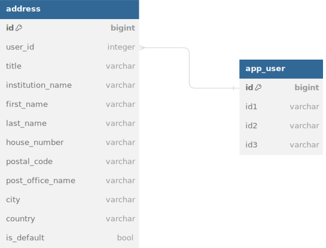

# Microservice API with Quarkus

This document provides instructions on how to start the Quarkus application using `docker-compose`, access its features, and interact with the API.

## Starting the Application

To start the application and its dependencies (such as the database and Traefik reverse proxy), navigate to the root directory of the project where the `docker-compose.yml` file is located, and run the following command:

```bash
docker-compose up -d
```

This command will start all the services defined in `docker-compose.yml` in detached mode.

## Setting up Dev container development environment

1. **Setup VS Code Docker Environment**: Install the Docker extension in VS Code and ensure Docker is running on your machine.

2. **Open the Project in VS Code**: Open the project in VS Code and click on the "Reopen in Container" button that appears in the bottom right corner of the window. This will open the project inside a Docker container.

2. **Run Gradle QuarkusDev**: Start the development server by running `gradle quarkusDev` inside the `gradle:jdk21` Docker container. This command enables hot reloading for live development.

3. **Access the Application**: Once `quarkusDev` is running, access your application at the specified URL. Changes to your code will be automatically detected and reflected in the running application without needing to restart the container.

### Testing

Tests were developed for majority of the functionality including edge cases. For testing the application, you can use the following command inside the development environment:

```bash
gradle test
```


## Accessing the Application

The application is placed behind Traefik, which acts as a reverse proxy and load balancer. Traefik manages the incoming requests and routes them to the appropriate service based on the configuration.

- **Application base URL**: [http://localhost/app](http://localhost/app)

  Access the main entry point of the application using this URL. Traefik routes the requests to the Quarkus application, ensuring seamless access.

## OpenAPI and Swagger UI

The application provides an OpenAPI specification, making it easy to understand and interact with the API.

- **OpenAPI Specification**: [http://localhost/app/openapi](http://localhost/app/openapi)

  This URL serves the raw OpenAPI specification in YAML format, providing detailed information about the API endpoints, parameters, and responses.

## Data Model Diagram



## Postman Collection

The Postman collection contains a set of requests to interact with the application's API. The collection can be imported into Postman to test the API endpoints.

- **Postman Collection**: [Microservice_API.postman_collection.json](Microservice_API.postman_collection.json)

  Import this collection into Postman to access the requests and test the API endpoints.

## Important Notes

- Ensure Docker and Docker Compose are installed and running on your machine before executing the `docker-compose up -d` command.
- The application and all related services are defined in the `docker-compose.yml` file. Review this file for details about the service configurations, networks, and volumes.
- Traefik's dashboard can be accessed at [http://localhost:8085](http://localhost:8085) to view the routing rules, services, and middlewares managed by Traefik.
- Make sure to stop and remove the containers when they are no longer needed by running `docker-compose down` to free up resources.
